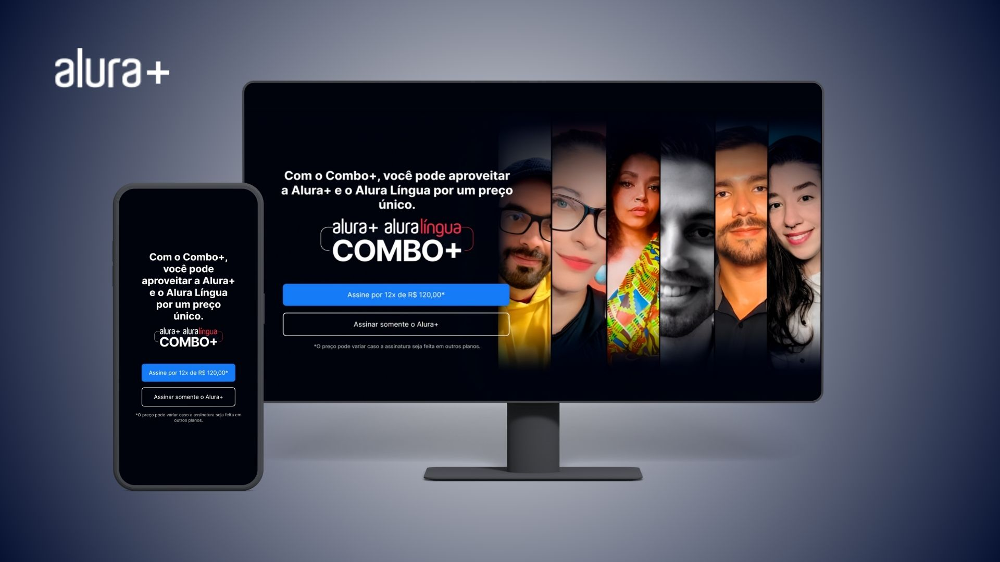

<h1 align="center"> Projeto - Alura+</h1>

 Foi o segundo projeto desenvolvido durante a Formação da Alura <a href="https://cursos.alura.com.br/degree/certificate/2e85c664-e5e4-450f-9994-074e43c763e0?lang=pt_BR">A partir do Zero: HTML e CSS para Projetos Web</a>. Foram utilizados os conceitos de flexbox, display grid e responsividade para diversos tamanhos de tela. O design no Figma foi utilizado como base para o projeto. Apresenta a temática de uma plataforma de straeming fictícia chamada Alura+.

 
 

  

<h3>Página completa do projeto</h3> 
  

 

## 🚀 Tecnologias
* HTML e CSS
* Flexbox
* Display Grid

 

## 💻 Projeto
Para visualizar a última vesão do projeto clique abaixo:
 
 
Visite o [projeto](https://alura-plus-ashy-three.vercel.app/) online.
 
 

## 📚 Cursos Relacionados

### HTML e CSS: Praticando HTML/CSS
* Instrutora: Mônica Hillman
* Certificado: [Ver certificado](https://cursos.alura.com.br/certificate/8d188454-87cf-4dee-a57a-42702f6d7f64?lang=pt_BR)
 

---

Feito com muito ♥

Obrigado por visitar meu Github ♥
Me dê um "FOLLOW" que retribuo, vamos criar novas conexões 😊

Até a próxima! 👋😊
